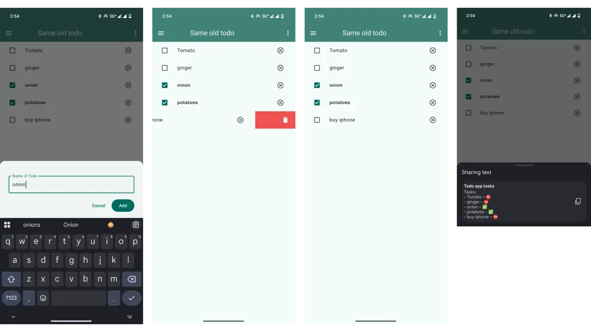

# Todd
Same old task manager that is inefficient.
This is made using a clean architecture called Domain-Driven Design.

## How to use
- Swipe up to add tasks.
- Click on the list to complete the task.
- Swipe from right to delete task.

That's it nothing special here.

## Screenshots

## 📱 Download app

